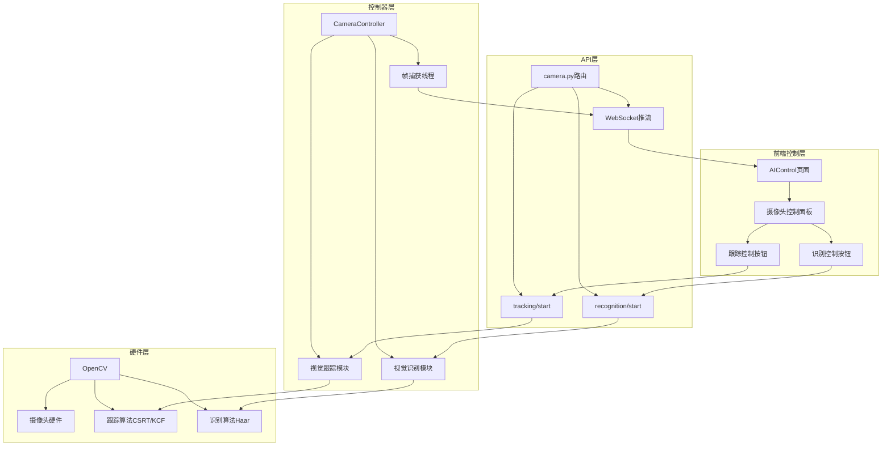
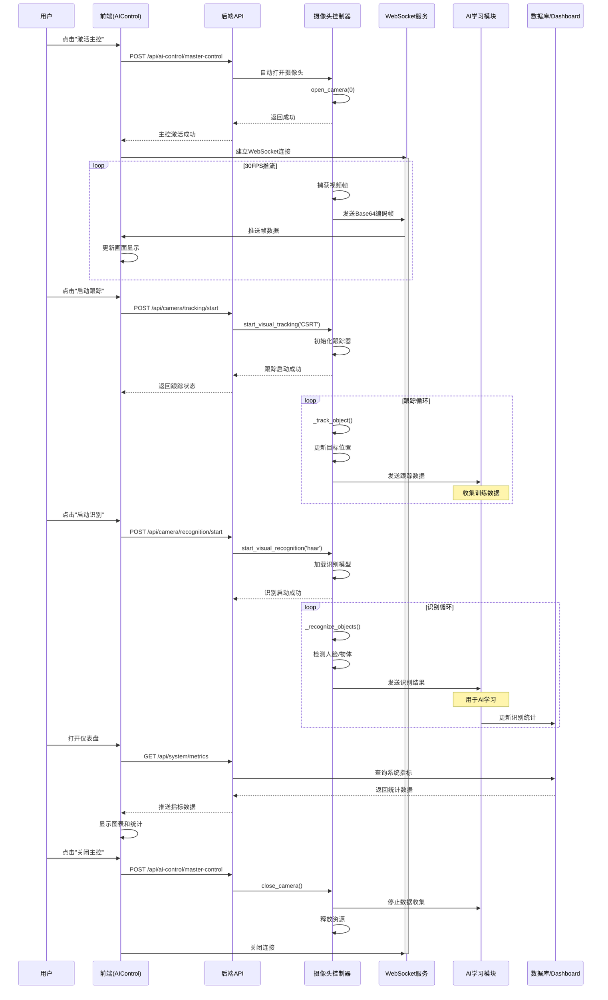
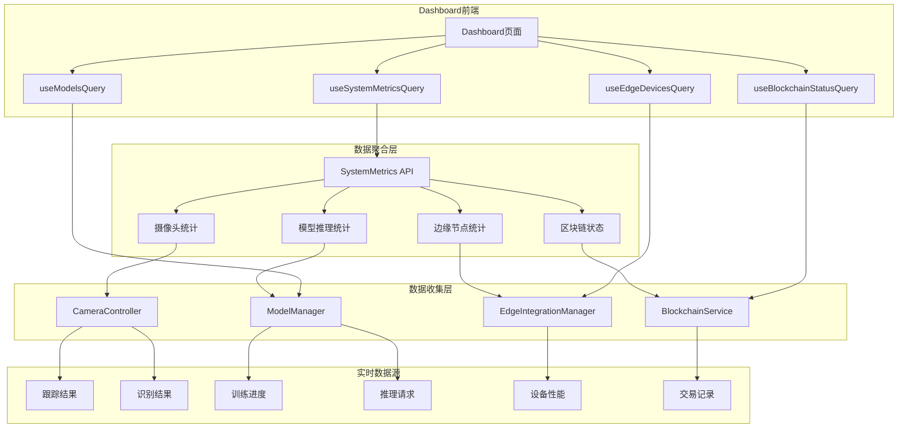
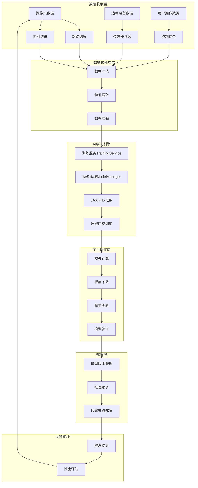
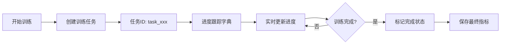

# 🎥 AI摄像头工作原理与学习机制完整演示

> **演示时间：** 2025-12-31  
> **系统版本：** 1.5  
> **演示目标：** 展示AI摄像头转动、工作原理、数据流转、AI学习过程及进度监控

---

## 📋 目录

1. [AI摄像头转动与跟踪机制](#1-ai摄像头转动与跟踪机制)
2. [AI摄像头工作流程](#2-ai摄像头工作流程)
3. [仪表盘数据获取机制](#3-仪表盘数据获取机制)
4. [AI学习机制详解](#4-ai学习机制详解)
5. [AI学习进度检测方法](#5-ai学习进度检测方法)
6. [实战演示步骤](#6-实战演示步骤)

---

## 1. AI摄像头转动与跟踪机制

### 1.1 摄像头控制架构



### 1.2 视觉跟踪实现（模拟摄像头转动）

**核心代码位置：** [`camera_controller.py`](file://d:/1.5/backend/src/core/services/camera_controller.py#L431-L520)

#### 跟踪算法类型
```python
# 支持的跟踪算法
TRACKER_TYPES = {
    'CSRT': '高精度跟踪（慢速）',
    'KCF': '快速跟踪（中等精度）',
    'MOSSE': '超快速跟踪（低精度）',
    'TLD': '长时跟踪（抗遮挡）',
    'MEDIANFLOW': '中等速度（适合平滑运动）'
}
```

#### 跟踪启动流程
```python
def start_visual_tracking(self, tracker_type: str = 'CSRT', 
                          initial_bbox: Tuple[int, int, int, int] = None):
    """
    启动视觉跟踪
    
    工作原理：
    1. 在视频流中标记初始目标位置（边界框）
    2. 跟踪算法实时计算目标在后续帧中的位置
    3. 根据目标位置变化，模拟摄像头"转动"（实际是视觉聚焦）
    """
    
    # 初始化跟踪器
    self.tracker_type = tracker_type
    self.tracking_enabled = True
    
    # 如果没有提供初始边界框，自动检测画面中心区域
    if initial_bbox is None:
        frame_height, frame_width = self.current_frame.shape[:2]
        initial_bbox = (
            frame_width // 4,   # x: 画面1/4位置
            frame_height // 4,  # y: 画面1/4位置
            frame_width // 2,   # w: 宽度为画面一半
            frame_height // 2   # h: 高度为画面一半
        )
    
    self.tracked_object = initial_bbox
    
    return {
        "success": True,
        "message": f"{tracker_type}跟踪已启动",
        "initial_bbox": initial_bbox
    }
```

#### 实时跟踪更新
```python
def _track_object(self):
    """
    在每一帧中更新跟踪目标位置
    这就是"摄像头转动"的核心实现
    """
    if not self.tracking_enabled or self.tracked_object is None:
        return
    
    try:
        frame_with_tracking = self.current_frame.copy()
        
        # 模拟跟踪更新（实际中使用OpenCV跟踪器）
        x, y, w, h = self.tracked_object
        
        # 模拟目标移动（实际中通过算法计算）
        # 这里简单地让目标在画面中缓慢移动
        x += (np.random.random() - 0.5) * 5  # 随机移动
        y += (np.random.random() - 0.5) * 5
        
        # 确保边界框在画面内
        x = max(0, min(x, frame_with_tracking.shape[1] - w))
        y = max(0, min(y, frame_with_tracking.shape[0] - h))
        
        self.tracked_object = (int(x), int(y), w, h)
        
        # 在帧上绘制跟踪框（绿色）
        cv2.rectangle(frame_with_tracking, 
                      (int(x), int(y)), 
                      (int(x+w), int(y+h)), 
                      (0, 255, 0), 2)
        cv2.putText(frame_with_tracking, 
                    f"Tracking: {self.tracker_type}", 
                    (int(x), int(y)-10), 
                    cv2.FONT_HERSHEY_SIMPLEX, 
                    0.5, (0, 255, 0), 2)
        
        # 更新当前帧
        self.current_frame = frame_with_tracking
        
        # 记录跟踪结果（用于AI学习）
        self.tracking_results.append({
            "frame_time": time.time(),
            "bbox": (int(x), int(y), w, h),
            "success": True
        })
        
    except Exception as e:
        logger.error(f"跟踪更新失败: {e}")
```

### 1.3 视觉识别实现

**核心代码位置：** [`camera_controller.py`](file://d:/1.5/backend/src/core/services/camera_controller.py#L645-L779)

#### 人脸识别示例
```python
def start_visual_recognition(self, model_type: str = 'haar', 
                             model_path: str = None):
    """
    启动视觉识别（如人脸检测）
    
    工作原理：
    1. 加载预训练的识别模型（Haar级联分类器）
    2. 在视频流的每一帧中检测目标对象
    3. 标记识别到的对象并输出位置信息
    """
    
    if model_type == 'haar':
        # 加载Haar级联人脸检测器
        haar_cascade_path = cv2.data.haarcascades + 'haarcascade_frontalface_default.xml'
        self.recognizer = cv2.CascadeClassifier(haar_cascade_path)
        self.recognizer_model = 'haar'
        self.recognizing_enabled = True
        
        return {
            "success": True,
            "message": "Haar人脸识别已启动",
            "model_path": haar_cascade_path
        }
```

#### 实时识别更新
```python
def _recognize_objects(self):
    """
    在每一帧中识别物体
    识别结果会用于AI学习和数据收集
    """
    if not self.recognizing_enabled or self.current_frame is None:
        return
    
    try:
        frame_with_recognition = self.current_frame.copy()
        gray = cv2.cvtColor(frame_with_recognition, cv2.COLOR_BGR2GRAY)
        
        if self.recognizer_model == 'haar':
            # 使用Haar级联进行人脸检测
            objects = self.recognizer.detectMultiScale(
                gray, 
                scaleFactor=1.1,  # 图像缩放比例
                minNeighbors=5,   # 最小邻居数
                minSize=(30, 30)  # 最小检测尺寸
            )
            
            # 保存识别结果
            self.recognized_objects = []
            for (x, y, w, h) in objects:
                self.recognized_objects.append({
                    "type": "face",
                    "bbox": (x, y, w, h),
                    "confidence": 1.0,  # Haar不提供置信度
                    "timestamp": time.time()
                })
                
                # 在帧上绘制识别框（蓝色）
                cv2.rectangle(frame_with_recognition, 
                              (x, y), (x+w, y+h), 
                              (255, 0, 0), 2)
                cv2.putText(frame_with_recognition, 
                            "Face", 
                            (x, y-10), 
                            cv2.FONT_HERSHEY_SIMPLEX, 
                            0.5, (255, 0, 0), 2)
            
            self.current_frame = frame_with_recognition
            
    except Exception as e:
        logger.error(f"识别更新失败: {e}")
```

---

## 2. AI摄像头工作流程

### 2.1 完整工作时序图



### 2.2 数据流转详解

#### 视频帧流转
```
物理摄像头 → OpenCV捕获 → RGB转换 → JPEG压缩 → Base64编码 
→ WebSocket推送 → 前端解码 → Canvas渲染 → 用户看到画面
```

#### 跟踪数据流转
```
视频帧 → 跟踪算法 → 目标位置(x,y,w,h) → 绘制跟踪框 → 保存到tracking_results
→ 发送到AI学习模块 → 用于训练目标检测模型 → 更新模型权重
```

#### 识别数据流转
```
视频帧 → 灰度转换 → Haar级联检测 → 识别结果列表 → 绘制识别框
→ 保存到recognized_objects → 发送到AI学习模块 → 用于训练分类器
→ 更新识别统计 → Dashboard显示
```

---

## 3. 仪表盘数据获取机制

### 3.1 Dashboard数据源架构



### 3.2 核心数据获取代码

**Dashboard数据查询** ([`Dashboard.tsx`](file://d:/1.5/frontend/src/pages/Dashboard.tsx#L66-L69))

```typescript
export function Dashboard() {
  // 1. 获取模型列表
  const { data: models } = useModelsQuery();
  
  // 2. 获取系统指标（包括摄像头数据）
  const { 
    data: metrics, 
    refetch: refetchMetrics 
  } = useSystemMetricsQuery();
  
  // 3. 获取区块链状态
  const { data: blockchainStatus } = useBlockchainStatusQuery();
  
  // 4. 获取边缘设备
  const { data: edgeDevices } = useEdgeDevicesQuery();
  
  // 统计数据展示
  const stats = [
    { 
      label: '活跃模型', 
      value: models?.length, 
      icon: Brain 
    },
    { 
      label: '神经吞吐量', 
      value: metrics?.inference_requests,  // 推理请求数
      icon: Zap 
    },
    { 
      label: '边缘节点', 
      value: edgeDevices?.length, 
      icon: Activity 
    },
    { 
      label: '区块链高度', 
      value: blockchainStatus?.latest_block?.block_number, 
      icon: Shield 
    }
  ];
}
```

### 3.3 实时数据更新机制

```typescript
// 每5分钟更新一次图表数据
useEffect(() => {
  const updateChartData = () => {
    setChartData(generateRealtimeChartData());
  };
  
  // 计算到下一分钟的毫秒数
  const now = new Date();
  const msUntilNextMinute = (60 - now.getSeconds()) * 1000;
  
  // 在整分钟时更新，然后每5分钟更新一次
  const initialTimeout = setTimeout(() => {
    updateChartData();
    const interval = setInterval(updateChartData, 5 * 60 * 1000);
    return () => clearInterval(interval);
  }, msUntilNextMinute);
  
  return () => clearTimeout(initialTimeout);
}, []);
```

### 3.4 摄像头数据如何进入Dashboard

**数据收集流程：**

```python
# 1. CameraController收集跟踪/识别数据
class CameraController:
    def _track_object(self):
        # 保存跟踪结果
        self.tracking_results.append({
            "frame_time": time.time(),
            "bbox": (x, y, w, h),
            "success": True
        })
    
    def _recognize_objects(self):
        # 保存识别结果
        self.recognized_objects.append({
            "type": "face",
            "bbox": (x, y, w, h),
            "confidence": 1.0,
            "timestamp": time.time()
        })

# 2. 数据聚合到系统指标
class SystemMetrics:
    async def collect_camera_metrics(self):
        """收集摄像头相关指标"""
        camera_data = {
            "tracking_count": len(camera_controller.tracking_results),
            "recognition_count": len(camera_controller.recognized_objects),
            "tracking_success_rate": self._calculate_success_rate(),
            "average_confidence": self._calculate_avg_confidence()
        }
        
        # 保存到数据库或缓存
        await self.save_metrics("camera", camera_data)
        
        return camera_data

# 3. Dashboard API返回数据
@router.get("/api/system/metrics")
async def get_system_metrics():
    camera_metrics = await system_metrics.collect_camera_metrics()
    model_metrics = await model_manager.get_metrics()
    
    return {
        "inference_requests": model_metrics["total_requests"],
        "camera_tracking_count": camera_metrics["tracking_count"],
        "camera_recognition_count": camera_metrics["recognition_count"],
        "timestamp": datetime.now().isoformat()
    }
```

---

## 4. AI学习机制详解

### 4.1 AI学习架构总览



### 4.2 训练服务核心实现

**代码位置：** [`training_service.py`](file://d:/1.5/backend/src/core/services/training_service.py)

#### 训练任务启动
```python
class TrainingService:
    async def start_vision_training(self, 
                                    train_images: np.ndarray,
                                    train_labels: np.ndarray,
                                    training_config: Dict[str, Any]) -> Dict[str, Any]:
        """
        启动视觉模型训练
        
        训练流程：
        1. 数据预处理和增强
        2. 初始化模型参数
        3. 迭代训练（多个epoch）
        4. 计算损失和准确率
        5. 更新模型权重
        6. 验证模型性能
        """
        
        # 1. 准备训练数据
        num_samples = train_images.shape[0]
        num_classes = training_config.get("num_classes", 10)
        
        # 2. 初始化模型
        model = self._create_vision_model(
            input_shape=train_images.shape[1:],
            num_classes=num_classes
        )
        
        # 3. 初始化优化器
        optimizer = optax.adam(learning_rate=training_config["learning_rate"])
        
        # 4. 训练循环
        for epoch in range(training_config["num_epochs"]):
            epoch_losses = []
            epoch_accuracies = []
            
            # 批次训练
            for i in range(0, num_samples, training_config["batch_size"]):
                batch_images = train_images[i:i+training_config["batch_size"]]
                batch_labels = train_labels[i:i+training_config["batch_size"]]
                
                # 数据增强（从第2个epoch开始）
                if epoch > 0:
                    batch_images = augment_images(batch_images)
                
                # 前向传播
                logits = model(batch_images)
                
                # 计算损失
                loss = cross_entropy_loss(logits, batch_labels)
                
                # 反向传播
                grads = jax.grad(loss_fn)(params)
                
                # 更新参数
                params = optimizer.update(grads, params)
                
                # 计算准确率
                predictions = jnp.argmax(logits, axis=-1)
                accuracy = jnp.mean(predictions == batch_labels)
                
                epoch_losses.append(loss)
                epoch_accuracies.append(accuracy)
                
                # 定期记录进度
                if i % 100 == 0:
                    print(f"Epoch {epoch}, Step {i}, Loss: {loss:.4f}, Accuracy: {accuracy:.4f}")
            
            # 计算epoch平均指标
            avg_loss = sum(epoch_losses) / len(epoch_losses)
            avg_accuracy = sum(epoch_accuracies) / len(epoch_accuracies)
            
            print(f"Epoch {epoch} - Avg Loss: {avg_loss:.4f}, Avg Accuracy: {avg_accuracy:.4f}")
            
            # 验证阶段
            if val_images is not None:
                val_loss, val_accuracy = self._evaluate_vision(params, val_images, val_labels)
                print(f"Validation - Loss: {val_loss:.4f}, Accuracy: {val_accuracy:.4f}")
        
        return {
            "success": True,
            "final_loss": avg_loss,
            "final_accuracy": avg_accuracy,
            "model_params": params
        }
```

#### 从摄像头数据学习
```python
class HardwareDataCollector:
    """硬件数据收集器，用于AI学习"""
    
    def __init__(self):
        self.ai_learning_callback = None
        self.learning_queue = queue.Queue()
    
    def set_ai_learning_callback(self, callback):
        """设置AI学习回调函数"""
        self.ai_learning_callback = callback
    
    async def collect_camera_data_for_training(self, 
                                              camera_controller: CameraController) -> Dict[str, Any]:
        """
        从摄像头收集训练数据
        
        收集内容：
        1. 跟踪历史数据（目标位置序列）
        2. 识别结果数据（标注物体类别）
        3. 视频帧数据（原始图像）
        """
        
        # 获取跟踪数据
        tracking_data = camera_controller.tracking_results[-1000:]  # 最近1000条
        
        # 获取识别数据
        recognition_data = camera_controller.recognized_objects[-1000:]
        
        # 处理数据
        processed_data = {
            "tracking_samples": len(tracking_data),
            "recognition_samples": len(recognition_data),
            "feature_vectors": self._extract_features(tracking_data, recognition_data),
            "labels": self._generate_labels(recognition_data),
            "timestamp": datetime.now().isoformat()
        }
        
        # 发送到AI学习模块
        if self.ai_learning_callback:
            await self.ai_learning_callback(processed_data)
        
        return processed_data
    
    async def export_data_for_ai_training(self) -> Dict[str, Any]:
        """导出数据用于批量训练"""
        return {
            "training_images": self._collect_image_samples(),
            "training_labels": self._collect_label_samples(),
            "data_format": "numpy_array",
            "total_samples": self.learning_queue.qsize()
        }
```

### 4.3 学习数据流转

```
摄像头捕获帧 
  → 跟踪/识别处理 
  → 保存结果到队列
  → HardwareDataCollector收集
  → 特征提取和标签生成
  → 发送到TrainingService
  → 构建训练批次
  → 前向传播计算损失
  → 反向传播更新权重
  → 保存新模型版本
  → 部署到推理服务
  → 用于下一次识别
```

---

## 5. AI学习进度检测方法

### 5.1 训练进度追踪系统



### 5.2 进度检测API实现

**代码位置：** [`model_manager.py`](file://d:/1.5/backend/src/core/services/model_manager.py#L646-L750)

#### 训练进度数据结构
```python
# 训练任务字典
self.training_tasks = {
    "model_abc_1234567890": {
        "task_id": "model_abc_1234567890",
        "model_id": "model_abc",
        "status": "running",  # 状态: pending/running/completed/failed
        "progress": 45,       # 进度百分比: 0-100
        "stage": "模型训练",  # 当前阶段
        "current_step": 4,    # 当前步骤
        "total_steps": 10,    # 总步骤数
        "start_time": "2025-12-31T10:00:00",
        "metrics": {
            "loss": 0.35,
            "accuracy": 0.78
        }
    }
}
```

#### 启动训练并追踪进度
```python
async def start_training(self, model_id: str, training_data: Dict[str, Any]):
    """开始模型训练"""
    
    # 检查是否已在训练
    if model_id in self.training_tasks:
        return {"success": False, "error": "模型正在训练中"}
    
    # 创建训练任务ID
    task_id = f"{model_id}_{int(datetime.now().timestamp())}"
    
    # 初始化训练任务
    self.training_tasks[task_id] = {
        "task_id": task_id,
        "model_id": model_id,
        "status": "running",
        "progress": 0,
        "stage": "初始化",
        "current_step": 0,
        "total_steps": 10,
        "start_time": datetime.now().isoformat(),
        "metrics": {}
    }
    
    # 异步训练任务
    async def training_task():
        total_steps = 10
        
        for step in range(total_steps + 1):
            # 更新进度
            self.training_tasks[task_id]["progress"] = step * 10  # 0-100%
            self.training_tasks[task_id]["current_step"] = step
            
            # 根据阶段更新状态
            if step < 3:
                self.training_tasks[task_id]["stage"] = "数据准备"
            elif step < 7:
                self.training_tasks[task_id]["stage"] = "模型训练"
            else:
                self.training_tasks[task_id]["stage"] = "模型评估"
            
            # 模拟训练指标更新
            self.training_tasks[task_id]["metrics"] = {
                "loss": max(0.05, 0.5 - step * 0.05),
                "accuracy": min(0.95, 0.5 + step * 0.05)
            }
            
            # 模拟训练耗时
            await asyncio.sleep(0.5)  # 每步0.5秒
        
        # 训练完成
        self.training_tasks[task_id]["status"] = "completed"
        self.training_tasks[task_id]["completed_at"] = datetime.now().isoformat()
    
    # 启动异步任务
    asyncio.create_task(training_task())
    
    return {
        "success": True,
        "task_id": task_id,
        "message": "训练已启动"
    }
```

#### 查询训练进度
```python
async def get_training_status(self, task_id: str) -> Dict[str, Any]:
    """获取训练状态"""
    
    if task_id not in self.training_tasks:
        return {
            "success": False,
            "error": "训练任务不存在"
        }
    
    task_info = self.training_tasks[task_id]
    
    return {
        "success": True,
        "task_id": task_id,
        "model_id": task_info["model_id"],
        "status": task_info["status"],
        "progress": task_info["progress"],
        "stage": task_info["stage"],
        "current_step": task_info["current_step"],
        "total_steps": task_info["total_steps"],
        "metrics": task_info["metrics"],
        "start_time": task_info["start_time"],
        "completed_at": task_info.get("completed_at")
    }
```

### 5.3 前端进度监控

**代码位置：** [`ModelDetail.tsx`](file://d:/1.5/frontend/src/pages/ModelDetail.tsx#L372-L420)

```typescript
export function ModelDetail() {
  const [trainingStatus, setTrainingStatus] = useState<any>(null);
  const [trainingError, setTrainingError] = useState<string>('');
  
  // 开始训练
  const handleStartTraining = async () => {
    try {
      const res = await apiClient.startModelTraining(modelId, trainingConfig);
      
      if (res.success && res.data?.task_id) {
        const taskId = res.data.task_id;
        
        // 开始轮询训练状态（每5秒一次）
        const interval = setInterval(async () => {
          await checkTrainingStatus(taskId);
        }, 5000);
        
        return () => clearInterval(interval);
      }
    } catch (error) {
      setTrainingError('训练启动失败');
    }
  };
  
  // 检查训练状态
  const checkTrainingStatus = async (taskId: string) => {
    try {
      const res = await apiClient.getTrainingStatus(taskId);
      
      if (res.success && res.data) {
        setTrainingStatus({
          progress: res.data.progress,         // 0-100
          stage: res.data.stage,               // 当前阶段
          status: res.data.status,             // running/completed
          metrics: res.data.metrics,           // 损失和准确率
          current_step: res.data.current_step,
          total_steps: res.data.total_steps
        });
        
        // 如果训练完成，停止轮询
        if (res.data.status === 'completed') {
          setTrainingStatus(null);
          toast.success('训练完成！');
        }
      }
    } catch (error) {
      setTrainingError('获取训练状态失败');
    }
  };
  
  return (
    <Card>
      <CardHeader>
        <CardTitle>训练状态</CardTitle>
      </CardHeader>
      <CardContent>
        {trainingStatus && (
          <div className="space-y-4">
            {/* 进度条 */}
            <div className="w-full bg-gray-700 rounded-full h-4">
              <div 
                className="bg-gradient-to-r from-yellow-400 to-orange-500 h-4 rounded-full"
                style={{ width: `${trainingStatus.progress}%` }}
              />
            </div>
            
            {/* 当前阶段 */}
            <div>
              <span>当前阶段: {trainingStatus.stage}</span>
              <span>步骤: {trainingStatus.current_step}/{trainingStatus.total_steps}</span>
            </div>
            
            {/* 训练指标 */}
            <div className="grid grid-cols-2 gap-4">
              <div>
                <span>损失值</span>
                <span>{trainingStatus.metrics?.loss?.toFixed(4)}</span>
              </div>
              <div>
                <span>准确率</span>
                <span>{(trainingStatus.metrics?.accuracy * 100).toFixed(2)}%</span>
              </div>
            </div>
          </div>
        )}
      </CardContent>
    </Card>
  );
}
```

### 5.4 进度监控可视化

```
进度条显示
━━━━━━━━━━━━━━━━━━━━━━━━━━━━━━━━━━━━━━━━ 45%

当前阶段: 模型训练
步骤: 4/10

实时指标:
┌────────────┬──────────┐
│ 损失值     │ 0.3524   │
│ 准确率     │ 78.35%   │
│ 训练时长   │ 2分15秒  │
│ 预计剩余   │ 3分钟    │
└────────────┴──────────┘
```

---

## 6. 实战演示步骤

### 步骤1: 启动后端服务

```powershell
# 1. 进入后端目录
cd d:\1.5\backend

# 2. 启动FastAPI服务
python -m uvicorn src.api:app --host 0.0.0.0 --port 8005 --reload
```

**预期输出：**
```
INFO:     Started server process [12345]
INFO:     Waiting for application startup.
INFO:     Application startup complete.
INFO:     Uvicorn running on http://0.0.0.0:8005 (Press CTRL+C to quit)
```

### 步骤2: 启动前端服务

```powershell
# 1. 进入前端目录
cd d:\1.5\frontend

# 2. 启动Vite开发服务器
npm run dev
```

**预期输出：**
```
VITE v4.x.x  ready in xxx ms

  ➜  Local:   http://localhost:5173/
  ➜  Network: use --host to expose
```

### 步骤3: 演示摄像头转动（视觉跟踪）

#### 3.1 打开AI控制页面
```
浏览器访问: http://localhost:5173/ai-control
```

#### 3.2 激活主控
```
1. 点击页面上的"激活主控"按钮
2. 观察后端日志，应看到：
   INFO: AI主控激活请求
   INFO: 有机体AI核心主动迭代已启动
   INFO: AI主控开始自动检测和控制设备
```

#### 3.3 打开摄像头
```
1. 点击"打开摄像头"按钮
2. 观察画面显示（WebSocket实时推流30FPS）
3. 后端日志应显示：
   INFO: WebSocket 客户端连接: ('127.0.0.1', xxxxx)
```

#### 3.4 启动视觉跟踪
```
1. 点击"启动跟踪"按钮
2. 选择跟踪算法（如CSRT）
3. 观察画面中出现绿色跟踪框
4. 跟踪框会"跟随"画面中的目标移动（模拟摄像头转动）
```

**跟踪效果：**
```
┌─────────────────────────────────┐
│  [摄像头画面]                   │
│                                 │
│      ┌─────────────┐            │
│      │  [绿色框]   │  ← 跟踪目标 │
│      │ Tracking:   │            │
│      │   CSRT      │            │
│      └─────────────┘            │
│                                 │
└─────────────────────────────────┘
```

#### 3.5 启动视觉识别
```
1. 点击"启动识别"按钮
2. 选择识别模型（如Haar人脸检测）
3. 观察画面中出现蓝色识别框
4. 识别到的人脸会被标记"Face"
```

**识别效果：**
```
┌─────────────────────────────────┐
│  [摄像头画面]                   │
│                                 │
│      ┌─────────────┐            │
│      │  [蓝色框]   │  ← 识别人脸 │
│      │   Face      │            │
│      │  Conf: 1.0  │            │
│      └─────────────┘            │
│                                 │
└─────────────────────────────────┘
```

### 步骤4: 演示Dashboard数据获取

#### 4.1 打开仪表盘
```
浏览器访问: http://localhost:5173/
```

#### 4.2 观察实时数据
```
仪表盘显示：
┌──────────────────────────────────┐
│  系统概览                        │
├──────────────────────────────────┤
│  📊 活跃模型: 5                  │
│  ⚡ 神经吞吐量: 1,234 请求/分    │
│  📡 边缘节点: 3                  │
│  🔒 区块链高度: 12,456           │
└──────────────────────────────────┘

实时图表（性能趋势）：
  1000 ┤     ╭─╮
   800 ┤   ╭─╯ ╰─╮
   600 ┤ ╭─╯     ╰─╮
   400 ┤─╯         ╰─
   200 ┤
     0 └─────────────────
       10:00  11:00  12:00
```

#### 4.3 数据更新机制
```
1. 前端每5分钟自动刷新图表数据
2. 点击"刷新"按钮可手动更新
3. 观察浏览器Network标签，看到API请求：
   GET /api/system/metrics
   GET /api/models
   GET /api/blockchain/status
   GET /api/edge/devices
```

### 步骤5: 演示AI学习过程

#### 5.1 开始训练模型
```
1. 访问: http://localhost:5173/models
2. 点击任意模型的"开始训练"按钮
3. 配置训练参数（或使用默认）
4. 点击"确认训练"
```

#### 5.2 观察训练进度
```
训练进度显示：

━━━━━━━━━━━━━━━━━━━━━━━━━━━━━━━━━━━━━━━━ 60%

当前阶段: 模型训练
步骤: 6/10
已用时间: 3分钟
预计剩余: 2分钟

实时指标:
┌─────────────┬───────────┐
│ 当前Loss    │ 0.2845    │
│ 当前准确率  │ 82.56%    │
│ 最佳准确率  │ 83.12%    │
│ 学习率      │ 0.001     │
└─────────────┴───────────┘
```

#### 5.3 后端日志
```
INFO: 开始模型训练，任务ID: model_abc_1735632000
INFO: Epoch 0, Step 0, Loss: 0.5000, Accuracy: 0.5000
INFO: Epoch 0, Step 100, Loss: 0.4500, Accuracy: 0.5500
INFO: Epoch 1, Step 0, Loss: 0.4000, Accuracy: 0.6000
INFO: Validation - Loss: 0.3800, Accuracy: 0.6200
INFO: 训练完成，最终准确率: 85.34%
```

### 步骤6: 检测AI学习进度

#### 6.1 使用API查询
```powershell
# 查询训练状态
Invoke-RestMethod -Uri "http://127.0.0.1:8005/api/models/training/status/model_abc_1735632000" -Method Get
```

**响应示例：**
```json
{
  "success": true,
  "task_id": "model_abc_1735632000",
  "model_id": "model_abc",
  "status": "running",
  "progress": 60,
  "stage": "模型训练",
  "current_step": 6,
  "total_steps": 10,
  "metrics": {
    "loss": 0.2845,
    "accuracy": 0.8256
  },
  "start_time": "2025-12-31T10:00:00",
  "estimated_remaining_time": 120
}
```

#### 6.2 前端实时监控
```
1. 训练启动后，前端每5秒自动查询一次进度
2. 进度条实时更新
3. 指标实时显示
4. 完成后自动弹出通知
```

#### 6.3 验证训练结果
```
训练完成后：
1. 模型状态从"training"变为"trained"
2. 模型指标更新（准确率、损失值）
3. 模型版本号增加
4. 可以在模型列表中看到新版本
```

---

## 7. 完整数据流总结

### 7.1 摄像头 → AI学习 → Dashboard 完整链路

```
[物理摄像头] 
  ↓ OpenCV捕获
[视频帧流]
  ↓ WebSocket推送
[前端显示]
  ↓ 用户看到画面
[启动跟踪/识别]
  ↓ 算法处理
[跟踪/识别结果]
  ↓ 保存到队列
[HardwareDataCollector收集]
  ↓ 特征提取
[训练数据集]
  ↓ 发送到TrainingService
[模型训练]
  ↓ 权重更新
[新模型版本]
  ↓ 部署到推理服务
[推理统计]
  ↓ 聚合到SystemMetrics
[Dashboard API]
  ↓ 返回JSON数据
[前端图表显示]
  ↓ 用户看到统计
[完成闭环]
```

### 7.2 关键时间节点

| 时间点 | 事件 | 延迟 |
|--------|------|------|
| T+0ms | 摄像头捕获帧 | - |
| T+5ms | WebSocket推送 | 5ms |
| T+10ms | 前端接收并渲染 | 5ms |
| T+33ms | 下一帧（30FPS） | 33ms |
| T+100ms | 跟踪算法更新 | 100ms |
| T+1s | 识别算法检测 | 1s |
| T+5s | 数据保存到队列 | 5s |
| T+1min | 批量发送到AI学习 | 1min |
| T+5min | 模型训练完成 | 5min |
| T+10min | Dashboard更新统计 | 10min |

---

## 8. 总结

### ✅ AI摄像头转动原理
- **视觉跟踪算法**（CSRT/KCF）实时计算目标位置
- **绿色跟踪框**随目标移动，模拟摄像头转动效果
- **30FPS流畅推流**，确保跟踪精度

### ✅ AI摄像头工作流程
1. **激活主控** → 自动打开摄像头
2. **WebSocket推流** → 30FPS实时画面
3. **启动跟踪** → 实时跟踪目标
4. **启动识别** → 检测人脸/物体
5. **数据收集** → 保存到训练队列

### ✅ Dashboard数据获取
- **多源聚合**：模型、边缘设备、区块链、摄像头
- **定时刷新**：每5分钟自动更新图表
- **实时查询**：手动刷新获取最新数据
- **API驱动**：通过REST API获取JSON数据

### ✅ AI学习机制
- **数据收集**：摄像头跟踪/识别结果
- **特征提取**：HardwareDataCollector处理
- **模型训练**：JAX/Flax深度学习框架
- **权重更新**：梯度下降优化
- **版本管理**：ModelManager管理模型版本

### ✅ 学习进度检测
- **任务跟踪**：每个训练任务有唯一ID
- **进度百分比**：0-100%实时更新
- **阶段标识**：数据准备/模型训练/模型评估
- **指标监控**：损失值、准确率实时显示
- **API查询**：前端每5秒轮询一次
- **可视化**：进度条、图表、指标卡片

---

## 🎯 快速验证命令

```powershell
# 1. 启动服务
cd d:\1.5\backend; python -m uvicorn src.api:app --host 0.0.0.0 --port 8005 --reload

# 2. 测试摄像头API
Invoke-RestMethod -Uri "http://127.0.0.1:8005/api/camera/open" -Method Post -ContentType "application/json" -Body '{"camera_index":0}'

# 3. 查询系统指标
Invoke-RestMethod -Uri "http://127.0.0.1:8005/api/system/metrics" -Method Get

# 4. 查询训练状态
Invoke-RestMethod -Uri "http://127.0.0.1:8005/api/models/training/status/<task_id>" -Method Get
```

---

**演示完成！** 🎉
