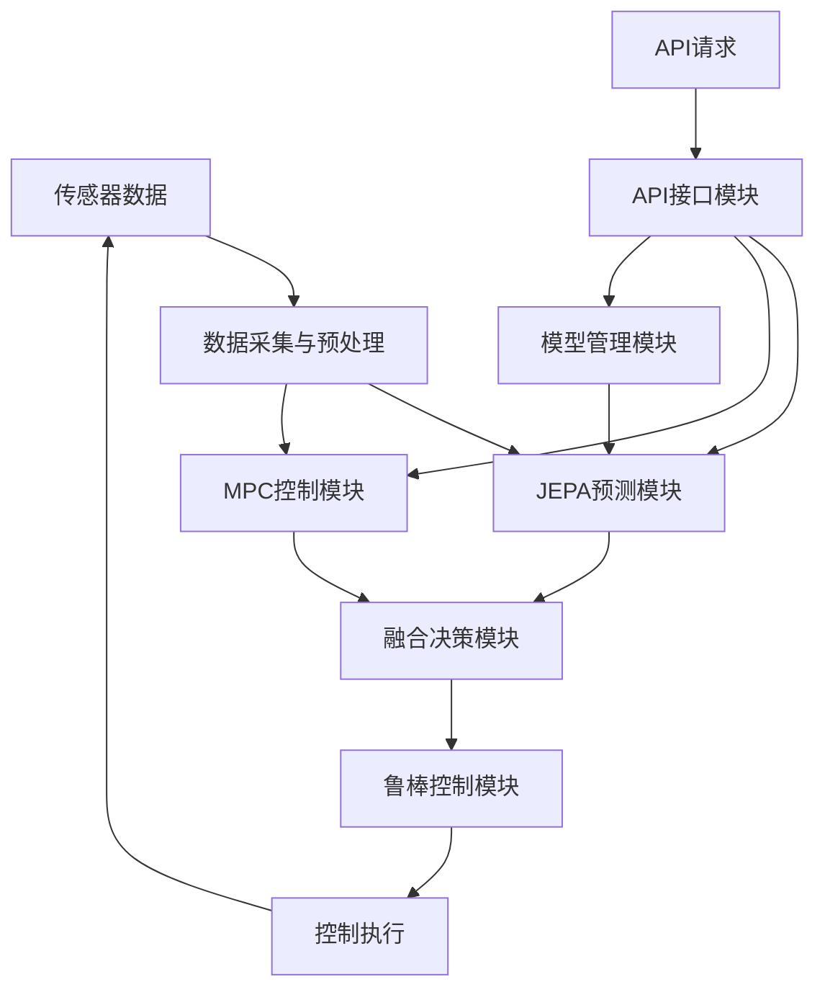

# JEPA预测与自主MPC集成架构文档

## 1. 系统概述

JEPA（Joint Embedding Predictive Architecture）预测与自主MPC（Model Predictive Control）集成系统是一种先进的智能控制解决方案，结合了深度学习预测能力和模型预测控制的优化能力，实现了更准确、更稳健的控制系统。

### 1.1 核心功能

- **JEPA预测**：基于深度学习的序列预测，能够捕获系统的复杂动态特性
- **MPC控制**：基于模型的预测控制，实现最优控制决策
- **智能融合**：将JEPA预测与MPC预测进行智能融合，提高预测准确性
- **自适应调整**：根据系统动态特性自动调整控制参数
- **鲁棒控制**：增强系统对扰动和不确定性的抵抗能力

### 1.2 应用场景

- **工业过程控制**：温度、压力、流量等过程变量的精确控制
- **机器人控制**：机械臂、移动机器人等的轨迹控制
- **能源管理**：电力、热力等能源系统的优化控制
- **环境控制**：温室、洁净室等环境参数的精确调节

## 2. 系统架构

### 2.1 整体架构

系统采用模块化设计，主要由以下组件组成：

1. **数据采集与预处理模块**：负责从传感器获取数据并进行预处理
2. **JEPA预测模块**：基于深度学习的序列预测模型
3. **MPC控制模块**：基于模型的预测控制算法
4. **融合决策模块**：融合JEPA预测与MPC预测的智能决策
5. **鲁棒控制模块**：处理扰动和不确定性
6. **API接口模块**：提供RESTful API接口
7. **模型管理模块**：负责模型的保存、加载和管理

### 2.2 数据流



### 2.3 模块详细说明

#### 2.3.1 JEPA预测模块

JEPA预测模块采用编码器-预测器-解码器架构：

- **编码器**：将输入数据编码为抽象嵌入表示
- **预测器**：根据当前嵌入预测未来嵌入
- **解码器**：将预测的嵌入解码为输出预测
- **能量函数**：评估预测质量

#### 2.3.2 MPC控制模块

MPC控制模块实现了基于模型的预测控制：

- **预测模型**：离散化的系统模型（FOPDT或SOPDT）
- **优化算法**：求解最优控制序列
- **约束处理**：处理控制量和被控变量的约束
- **自适应时域**：根据系统动态特性自动调整预测和控制时域

#### 2.3.3 融合决策模块

融合决策模块实现了JEPA预测与MPC预测的智能融合：

- **预测质量评估**：评估JEPA预测的质量
- **动态权重调整**：根据预测质量动态调整融合权重
- **预测融合**：将两种预测进行加权融合

#### 2.3.4 鲁棒控制模块

鲁棒控制模块增强系统的鲁棒性：

- **扰动估计**：估计外部扰动
- **模型修正**：基于预测误差修正模型参数
- **不确定性处理**：处理模型不确定性
- **自适应增益**：根据系统状态自动调整控制增益

## 3. 技术实现

### 3.1 技术栈

- **后端**：Python 3.12, FastAPI
- **深度学习**：PyTorch
- **数值计算**：NumPy, SciPy
- **API**：RESTful API
- **部署**：Docker, Kubernetes

### 3.2 核心文件结构

```
backend/
├── jepa_core.py              # JEPA核心实现
├── dt_mpc_core.py            # MPC核心实现
├── jepa_dtmpc_integration.py  # JEPA-MPC集成实现
├── src/
│   └── api/
│       └── routes/
│           └── jepa_dtmpc.py  # API接口实现
└── jepa_models/              # 模型保存目录
```

### 3.3 关键类和函数

#### 3.3.1 JEPA相关类

- **JEPAEncoder**：编码器类，将输入数据编码为嵌入
- **JEPAPredictor**：预测器类，预测未来嵌入
- **JEPADecoder**：解码器类，将嵌入解码为输出
- **EnergyFunction**：能量函数类，评估预测质量
- **JEPA**：完整JEPA架构类
- **JEPATrainer**：JEPA训练器类

#### 3.3.2 MPC相关类

- **MPCore**：MPC核心类，实现预测和优化
- **DTMpcDataProcessor**：数据处理器类
- **DTMpcController**：DT-MPC控制器类
- **DTMpcRobustController**：鲁棒控制器类
- **DTMpcParameterManager**：参数管理器类

#### 3.3.3 集成相关类

- **JepaDtmpcController**：JEPA-DT-MPC集成控制器类

### 3.4 API接口

| 端点 | 方法 | 功能 | 请求体 | 响应体 |
|------|------|------|--------|--------|
| /jepa-dtmpc/activate | POST | 激活控制器 | ActivateRequest | ActivateResponse |
| /jepa-dtmpc/train | POST | 训练模型 | TrainRequest | TrainResponse |
| /jepa-dtmpc/status | GET | 获取控制器状态 | N/A | 状态信息 |
| /jepa-dtmpc/prediction | GET | 获取预测结果 | N/A | 预测结果 |
| /jepa-dtmpc/model/save | POST | 保存模型 | SaveModelRequest | 保存结果 |
| /jepa-dtmpc/model/load | POST | 加载模型 | LoadModelRequest | 加载结果 |
| /jepa-dtmpc/model/list | GET | 获取模型列表 | N/A | 模型列表 |

## 4. 模型训练与优化

### 4.1 JEPA模型训练

JEPA模型训练采用以下步骤：

1. **数据准备**：收集历史数据，包括输入变量和输出变量
2. **数据预处理**：数据清洗、归一化、划分训练集和验证集
3. **模型初始化**：初始化JEPA模型参数
4. **训练过程**：执行多轮训练，使用早停策略防止过拟合
5. **模型评估**：评估模型在验证集上的性能
6. **模型保存**：保存训练好的模型

### 4.2 MPC参数优化

MPC参数优化采用以下策略：

1. **系统辨识**：通过PRBS测试辨识系统模型参数
2. **时域调整**：根据系统动态特性调整预测和控制时域
3. **权重调整**：根据控制目标调整代价函数权重
4. **约束设置**：根据系统实际情况设置控制量和被控变量的约束

### 4.3 融合策略优化

融合策略优化考虑以下因素：

1. **预测质量**：根据JEPA预测的能量值评估预测质量
2. **系统动态**：根据系统的动态特性调整融合权重
3. **不确定性**：考虑模型不确定性对融合策略的影响
4. **实时性**：确保融合决策的实时性

## 5. 系统部署与集成

### 5.1 本地部署

1. **环境准备**：安装Python 3.12及必要的依赖
2. **代码获取**：克隆代码库到本地
3. **依赖安装**：执行`pip install -r requirements.txt`
4. **服务启动**：执行`python start_server.py`启动后端服务
5. **API测试**：使用Postman或curl测试API接口

### 5.2 Docker部署

1. **Dockerfile创建**：创建Dockerfile文件
2. **镜像构建**：执行`docker build -t jepa-mpc .`构建镜像
3. **容器运行**：执行`docker run -p 8000:8000 jepa-mpc`运行容器

### 5.3 Kubernetes部署

1. **配置文件创建**：创建Deployment和Service配置文件
2. **部署应用**：执行`kubectl apply -f kubernetes/deployment.yaml`
3. **服务暴露**：执行`kubectl apply -f kubernetes/service.yaml`

## 6. 性能评估

### 6.1 评估指标

- **预测准确性**：均方误差（MSE）、平均绝对误差（MAE）
- **控制性能**：超调量、上升时间、调节时间
- **鲁棒性**：对扰动的响应速度和恢复能力
- **实时性**：控制计算时间
- **稳定性**：系统的稳定性和收敛性

### 6.2 基准测试

使用标准测试用例对系统进行基准测试：

1. **阶跃响应测试**：测试系统对阶跃输入的响应
2. **扰动响应测试**：测试系统对扰动的响应
3. **跟踪测试**：测试系统对参考轨迹的跟踪能力
4. **鲁棒性测试**：测试系统在模型不确定性下的性能

### 6.3 性能优化

根据性能评估结果，进行以下优化：

1. **模型优化**：调整JEPA模型结构和训练参数
2. **算法优化**：优化MPC求解算法
3. **融合策略优化**：改进融合决策策略
4. **硬件优化**：考虑使用GPU加速深度学习计算

## 7. 故障排除

### 7.1 常见问题

| 问题 | 可能原因 | 解决方案 |
|------|----------|----------|
| JEPA预测不准确 | 训练数据不足或质量差 | 增加训练数据，改善数据质量 |
| MPC控制不稳定 | 模型参数不准确 | 重新辨识系统模型，调整控制参数 |
| 融合预测偏差大 | 融合权重设置不当 | 调整融合策略，优化权重计算 |
| API响应缓慢 | 计算复杂度高 | 优化算法，考虑使用并行计算 |
| 系统振荡 | 控制增益过大 | 减小控制增益，增加阻尼 |

### 7.2 诊断工具

- **日志分析**：分析系统日志获取故障信息
- **性能监控**：监控系统性能指标
- **模型诊断**：评估模型性能和准确性
- **API测试**：测试API接口的响应和功能

## 8. 未来发展

### 8.1 技术路线图

1. **短期**：优化现有算法，提高预测准确性和控制性能
2. **中期**：添加多变量控制能力，支持更复杂的系统
3. **长期**：集成强化学习，实现自主学习和优化

### 8.2 潜在改进

- **多模态融合**：集成多种传感器数据，提高预测准确性
- **迁移学习**：利用预训练模型加速模型适应新场景
- **联邦学习**：在保护数据隐私的同时进行模型训练
- **数字孪生**：创建系统的数字孪生，实现虚拟调试和优化
- **自适应控制**：根据系统状态自动调整控制策略

### 8.3 应用拓展

- **智能交通**：交通信号控制、车辆轨迹优化
- **医疗健康**：医疗设备控制、患者生命体征监测
- **智能家居**：家居环境智能控制
- **农业生产**：温室环境控制、灌溉系统优化

## 9. 结论

JEPA预测与自主MPC集成系统是一种先进的智能控制解决方案，结合了深度学习的预测能力和模型预测控制的优化能力，能够实现更准确、更稳健的控制。系统采用模块化设计，具有良好的可扩展性和可维护性，可应用于多种控制场景。

通过持续的优化和改进，该系统有望在工业自动化、智能机器人、能源管理等领域发挥重要作用，为实现更高效、更智能的控制系统提供有力支持。